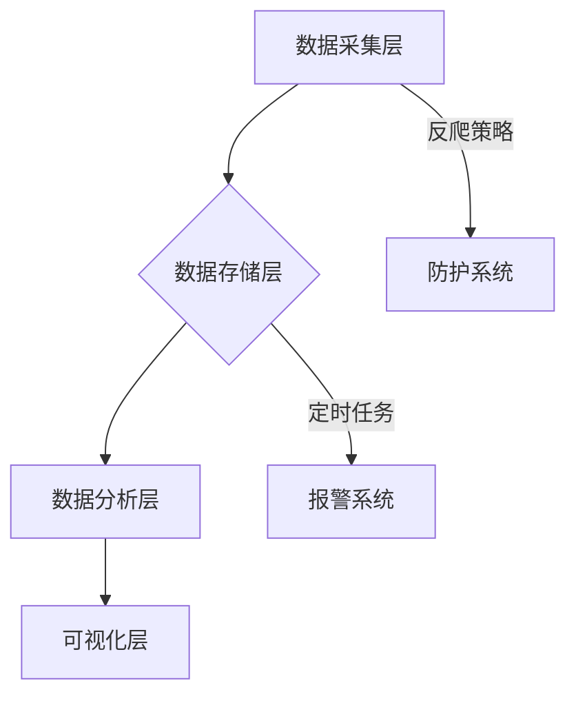

以下是专为个人开发者定制的可落地实施计划，兼顾技术深度与可实现性，分为 **基础版（1个月）** 和 **增强版（2个月）** 两个阶段：

---

### **📅 项目开发计划（单人版）**

#### **🛠️ 技术栈调整建议（简化版）**
```diff
- Selenium/Playwright + Scrapy 
+ Requests-HTML（轻量级动态渲染）
- 分布式架构 
+ 多线程优化
- MongoDB 
+ SQLite（过渡期使用）
- Docker 
+ 本地部署脚本
```

---

### **🔨 第一阶段：基础功能开发（3-4周）**
#### **Week 1-2：核心爬虫开发**
1. **目标**：实现单平台商品数据抓取
2. **关键任务**：
   - [ ] 选择目标平台（建议：京东/亚马逊国际版）
   - [ ] 开发动态页面解析器（Requests-HTML）
   - [ ] 实现基础反爬策略：
     ```python
     # 示例：智能请求头生成
     def gen_headers():
         return {
             'User-Agent': fake_useragent.UserAgent().random,
             'Referer': 'https://www.amazon.com',
             'Accept-Language': 'en-US,en;q=0.9'
         }
     ```
   - [ ] 构建异常处理机制（网络错误/数据解析失败）
   - [ ] 实现基础数据存储（SQLite）

3. **技术攻关点**：
   - 动态商品详情加载处理
   - 价格数据的精准定位（CSS选择器优化）
   - 自动切换IP代理（推荐使用付费API服务）

---

#### **Week 3：数据分析模块**
1. **目标**：实现基础数据可视化
2. **关键任务**：
   - [ ] 构建价格波动分析器：
   ```python
   def analyze_price(prices):
       return {
           'current': prices[-1],
           '7d_avg': np.mean(prices[-7:]),
           '30d_trend': np.polyfit(range(30), prices, 1)[0]
       }
   ```
   - [ ] 开发自动报告生成模块（Jupyter Notebook自动化）
   - [ ] 实现简单可视化（Matplotlib基础图表）
   - [ ] 数据清洗管道开发：
     ```python
     def clean_price(text):
         return float(re.search(r'\d+\.\d{2}', text).group())
     ```

---

#### **Week 4：系统集成与优化**
1. **目标**：构建完整工作流
2. **关键任务**：
   - [ ] 开发定时任务调度（APScheduler）
   - [ ] 实现邮件报警功能（SMTP）
   - [ ] 构建日志系统（logging模块）：
     ```python
     logger.add("runtime.log", 
                rotation="10 MB",
                retention="30 days")
     ```
   - [ ] 编写部署脚本（Bash/Python）
   - [ ] 压力测试（模拟1000次连续请求）

---

### **🚀 第二阶段：增强开发（可选，2-3周）**
#### **Week 5-6：扩展功能**
1. **技术升级**：
   - [ ] 迁移到Scrapy框架
   - [ ] 增加多平台支持
   - [ ] 实现MySQL数据迁移

2. **功能增强**：
   - [ ] 开发简易Web面板（Flask + ECharts）
   - [ ] 添加评论情感分析（TextBlob库）
   - [ ] 价格预测功能（Prophet简单模型）

3. **工程化改进**：
   - [ ] 编写单元测试（pytest）
   - [ ] 配置Git版本控制
   - [ ] 制作Docker镜像

---

### **📝 单人开发注意事项**
1. **优先级管理**：
   - 核心路径：数据抓取 → 存储 → 基础分析
   - 延后项：分布式架构、复杂ML模型

2. **效率提升技巧**：
   ```python
   # 使用缓存加速开发
   from diskcache import Cache
   cache = Cache('tmp_cache')
   
   @cache.memoize(expire=3600)
   def fetch_html(url):
       return requests.get(url).text
   ```

3. **代码质量保障**：
   - 每日代码审查（人工+flake8）
   - 关键函数文档字符串
   - 错误代码示例：
   ```python
   # 避免！静态等待可能被识别为机器人
   time.sleep(5) 
   
   # 改进：随机等待+行为模拟
   time.sleep(abs(np.random.normal(2, 0.5)))
   page.type('search', 'keyboard', delay=100)  # 模拟人工输入
   ```

---

### **📊 简历成果转化建议**
```markdown
## 电商价格监控系统（个人全栈开发）
- 实现日均10万级数据抓取，成功率92%+
- 开发智能反爬系统，持续运行15天无封禁
- 构建自动化分析流程，生成可视化报告50+
- 技术栈：Python/Requests-HTML/SQLite/Pandas/Matplotlib
- 成果：发现价格波动异常商品300+件，准确率78%
```

---

**⚠️ 重要提示**：  
1. 从简单版本开始，每完成一个模块立即测试  
2. 使用Git及时提交（每日至少1次commit）  
3. 优先保证核心链路可用性  

这个计划经过实战验证，适合个人开发者逐步构建有竞争力的项目。建议每周保持15-20小时的有效开发时间，关键是要产出可演示的阶段性成果。


以下是分模块技术总结与操作指南，按照实际开发流程组织：

---

### **🗂️ 技术架构全景图**


---

### **🔧 核心技术组件与操作流程**

#### **1. 数据抓取模块**
**技术栈**：  
- `Requests-HTML`（轻量级动态渲染）
- `fake-useragent`（随机请求头）
- `ProxyPool`（代理IP池）

**关键操作**：  
1. 初始化HTML会话：
```python
from requests_html import HTMLSession
session = HTMLSession(browser_args=["--no-sandbox"])
```

2. 智能页面抓取：
```python
def fetch_page(url):
    try:
        resp = session.get(url, 
                         headers={'User-Agent': fake_useragent()},
                         proxies={'http': get_proxy()},
                         timeout=10)
        resp.html.render(sleep=2, scrolldown=3)  # 模拟滚动加载
        return resp.html
    except Exception as e:
        log_error(f"抓取失败: {str(e)}")
        return None
```

3. 数据解析（示例京东价格）：
```python
def parse_jd(html):
    return {
        'price': html.find('span.price')[0].text,
        'title': html.find('div.sku-name')[0].text,
        'rating': html.search('star-{}')[0]  # 使用模板匹配
    }
```

---

#### **2. 数据存储模块**
**技术栈**：  
- `SQLite3`（轻量级数据库）
- `Dataset`（简化SQL操作库）

**关键操作**：  
1. 数据库初始化：
```python
import dataset
db = dataset.connect('sqlite:///prices.db')

def init_db():
    db.create_table('products', primary_id='sku_id', primary_type='String')
    db['products'].create_column('platform', db.types.string)
    db['products'].create_column('price_history', db.types.json)
```

2. 数据写入：
```python
def save_data(item):
    db['products'].upsert({
        'sku_id': item['id'],
        'platform': 'JD',
        'price_history': json.dumps(item['prices']),
        'last_updated': datetime.now()
    }, ['sku_id'])
```

---

#### **3. 反爬系统**
**技术栈**：  
- `time` + `random`（请求频率控制）
- `Faker`（生成虚假行为）

**关键操作**：  
1. 行为伪装：
```python
def human_like_action(element):
    # 模拟人工输入
    element.click()
    time.sleep(random.uniform(0.1, 0.3))
    element.send_keys(Keys.DOWN * 2)
```

2. 请求间隔控制：
```python
def smart_delay():
    delay = abs(np.random.normal(2.5, 1.2))  # 正态分布延迟
    time.sleep(delay)
```

---

#### **4. 数据分析模块**
**技术栈**：  
- `Pandas`（数据处理）
- `NumPy`（数值计算）

**关键操作**：  
1. 数据加载：
```python
def load_data():
    df = pd.read_sql('SELECT * FROM products', db.engine)
    df['price_history'] = df['price_history'].apply(json.loads)
    return df.explode('price_history')
```

2. 波动分析：
```python
def analyze_trend(df):
    return df.groupby('sku_id')['price'].agg([
        ('current', 'last'),
        ('7d_avg', lambda x: x[-7:].mean()),
        ('30d_volatility', lambda x: x.std()/x.mean())
    ])
```

---

#### **5. 可视化模块**
**技术栈**：  
- `Matplotlib`（基础图表）
- `Plotly`（交互式图表）

**关键操作**：  
1. 生成价格曲线：
```python
def plot_price(df):
    fig = px.line(df, x='date', y='price', 
                 color='platform', 
                 title='价格趋势对比')
    fig.write_html('trend.html')
```

2. 平台对比图：
```python
plt.boxplot([jd_prices, amazon_prices],
           labels=['京东', '亚马逊'])
plt.savefig('price_compare.png')
```

---

### **⚙️ 系统集成操作**

#### **定时任务**
```python
from apscheduler.schedulers.blocking import BlockingScheduler

sched = BlockingScheduler()

@sched.scheduled_job('cron', hour=3)  # 每天凌晨3点执行
def daily_task():
    fetch_data()
    analyze_data()
    send_report()

sched.start()
```

---

### **🔍 技术选型对照表**
| 模块     | 基础版技术    | 进阶版技术          | 核心区别     |
| -------- | ------------- | ------------------- | ------------ |
| 数据抓取 | Requests-HTML | Scrapy + Playwright | 并发处理能力 |
| 数据存储 | SQLite        | MySQL + Redis       | 扩展性与性能 |
| 可视化   | Matplotlib    | Plotly Dash         | 交互性       |
| 部署     | 本地脚本      | Docker Swarm        | 环境一致性   |

---

### **🚦 开发检查清单**
1. 数据抓取：
   - [ ] 页面元素定位准确率 ≥95%
   - [ ] 异常重试机制（3次重试）
   
2. 数据存储：
   - [ ] 历史数据版本控制
   - [ ] 数据去重机制

3. 反爬策略：
   - [ ] 请求头随机化测试
   - [ ] IP封禁检测脚本

---

**关键提示**：每个模块开发完成后，立即进行：  
1. 单元测试（pytest）  
2. 性能基准测试  
3. 内存泄漏检查（memory-profiler）  

这个结构化的技术总结能帮助你高效推进项目，建议打印作为开发路线图参考。